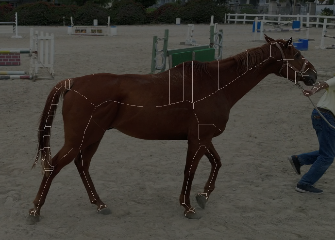
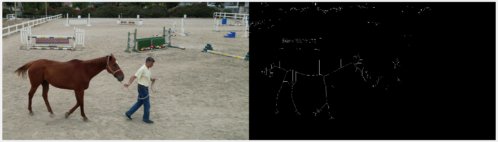
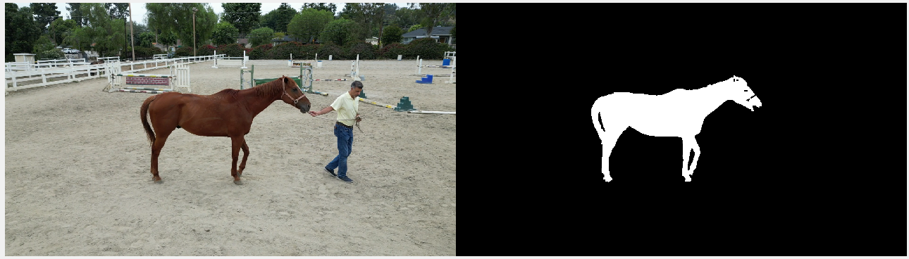
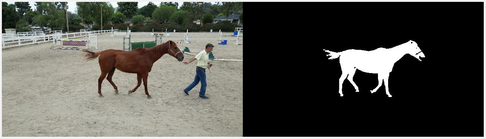

# This Repository is for the IMU PROJECT - EGR 4820 - 4830

This Repo will contains the development of the Computer Vision Aspect of this project
The main maintainer and contributor for this project is me, Jonathan Hanbali.

For more information of the MATLAB functions that are being used, please check our wiki page. For this project, we are using MATLAB version 2021b

For more information about the parent repository for this project, please visit:
[Hoof - IMU](https://github.com/kyobg/HOOF-IMU)

Before Blob Analysis:

After Blob Analysis:

Notice that before the blob analysis, we encounter a lot of noise, since the color difference method is not perfect in essence (it will also read some other colors that the image/video contains, so not everything is isolated). The blob analysis will analyze the image/video and will eliminate "smaller blobs", such that we have an isolated image of the bigger blobs since we tailored our color masking to the color of the horse itself. 

Our current progress is located at:
[Horse 3](Vision/MATLAB%20SKELETON/horse_test3.m)

Current Mask:
[Mask 6](Vision/MATLAB%20SKELETON/createMask6.m)

===========================================================================

Improvements:
- [x] Better color masking
- [x] Blob Analysis to minimize other objects
- [ ] Minimize the missing hoof masking (less mask perhaps)
- [ ] Cleaner skeleton with only main line showings
- [ ] Overlay the skeleton with lines to have a thicker and better skeletons
- [ ] Writing the video output as a file for ease of use

===========================================================================

Notes:
- This project is based on [Image Processing Toolbox](https://www.mathworks.com/products/image.html) on MATLAB. In order to make this project to work properly, you would need to download the Image Processing Toolbox from MATLAB and install it on your computer.
